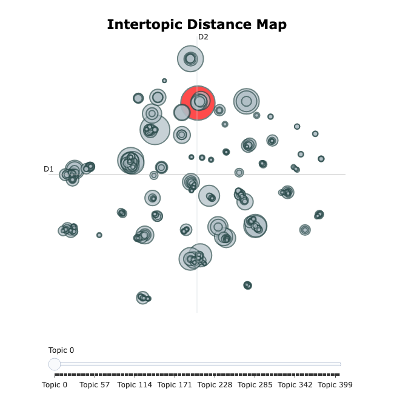
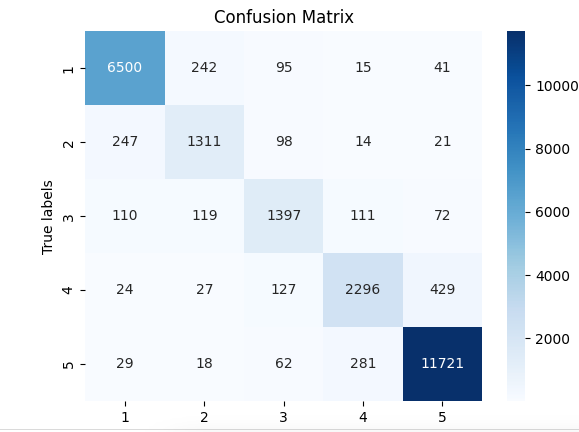
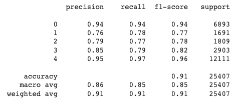

# Topic Modelling & Rating Classification of Amazon Reviews

Two NLP tasks on **~50,800 Amazon reviews of Apple cell-phones & accessories**:

1. **Topic modelling** — use **BERTopic** to discover, unsupervised, what customers actually talk about.
2. **Rating classification** — predict a review's 1–5★ rating, benchmarking **Logistic Regression** and **Naive Bayes** against a fine-tuned **BERT** classifier.

Final examination paper for the *Natural Language Processing* course, M.Sc. Business Administration & Data Science, Copenhagen Business School (2023).

## Research questions

1. How can a company use unsupervised topic modelling (BERTopic) to understand the topics and concepts discussed in its reviews?
2. To what extent can a supervised BERT classifier predict review ratings (1–5★) compared to Logistic Regression and Naive Bayes baselines?

## Data

The [Amazon Review Data (2018)](https://nijianmo.github.io/amazon/) (Ni et al., UCSD). Starting from the ~10M "Cell Phones & Accessories" reviews, the pipeline filters to **Apple** products (66,089 reviews) and preprocesses down to a clean corpus of **50,813** reviews.

Preprocessing highlights (`01_text_preprocessing.ipynb`): merge `summary` + `reviewText` into one `corpus`; blank out "Five Stars"-style summaries that leak the label (24,641 rows); drop empty, non-English (`langdetect`), duplicate, and <5-word reviews. The rating distribution is heavily imbalanced (skewed to 1★ and 5★).

## Pipeline

| Notebook | Step |
|---|---|
| `00_data_filtering.ipynb` | Filter the 10M-row Amazon dump down to 66k Apple reviews. |
| `01_text_preprocessing.ipynb` | Clean / filter / merge → `apple_text_preprocessed.csv` (50,813 reviews). |
| `02_topic_modeling_bertopic.ipynb` | **BERTopic** — Sentence-BERT (`all-MiniLM-L6-v2`) → UMAP → HDBSCAN → c-TF-IDF; 30 topics (min size 100). |
| `03_classification_lr_nb.ipynb` | **Baselines** — Logistic Regression & Naive Bayes on a bag-of-words / TF-IDF representation, tuned via randomized grid-search CV. |
| `04_classification_bert.ipynb` | **BERT classifier** — fine-tuned `bert-base-uncased` (`BertForSequenceClassification`), 10 epochs. |

## Results

### Topic modelling (BERTopic)

BERTopic surfaces clean, interpretable themes — accessories (cases/clips), battery & charging, carrier unlocking, condition/refurbished, and more. Topics were evaluated by manual inspection (interactive 2-D topic map + word clouds), not a quantitative coherence metric.




### Rating classification

The fine-tuned BERT classifier decisively beats the bag-of-words baselines, especially on the hard, under-represented middle ratings (2–4★):

| Model | Precision | Recall | F1 (macro) |
|-------|:---------:|:------:|:----------:|
| Logistic Regression | 0.47 | 0.48 | 0.47 |
| Naive Bayes | 0.51 | 0.37 | 0.33 |
| **BERT classifier** | **0.86** | **0.85** | **0.85** |




> Because the ratings are imbalanced, **macro-F1** is the headline metric (it weights all five classes equally). The baselines collapse onto the two majority classes (NB scores F1 = 0.00 on 2★); BERT classifies the minority ratings far more reliably.

## Repository structure

```
.
├── 00_data_filtering.ipynb            # 10M Amazon reviews → 66k Apple
├── 01_text_preprocessing.ipynb        # clean/filter → 50,813 reviews
├── 02_topic_modeling_bertopic.ipynb   # BERTopic (30 topics)
├── 03_classification_lr_nb.ipynb      # Logistic Regression + Naive Bayes baselines
├── 04_classification_bert.ipynb       # fine-tuned BERT classifier (0.85 macro-F1)
├── apple.csv                          # raw Apple reviews
├── apple_text_preprocessed.csv        # cleaned corpus
├── docs/                              # figures used in this README
└── experiments/                       # exploratory alternatives (not in the paper)
    ├── top2vec.ipynb                  # Top2Vec topic modelling
    ├── bertopic_library.ipynb         # earlier BERTopic exploration
    └── bertopic_from_scratch.ipynb    # BERTopic reimplemented by hand (UMAP→HDBSCAN→c-TF-IDF)
```

## Running

Developed in Google Colab (GPU recommended; the BERT fine-tune takes ~4h on a single GPU). Locally:

```bash
python3 -m venv .venv && source .venv/bin/activate
pip install -r requirements.txt
jupyter lab
```

Run the notebooks in order (`00` → `04`); `02`–`04` read `apple_text_preprocessed.csv`.

## Team

Finn Feddersen, Elias Froholt, Vegard Gansmoe, Poul Nissen (supervisors: Rajani Singh, Sine Zambach, Daniel Hardt).

## Acknowledgements

Built on [BERTopic](https://github.com/MaartenGr/BERTopic), [Hugging Face Transformers](https://github.com/huggingface/transformers), and scikit-learn. Review data: [Amazon Review Data (2018)](https://nijianmo.github.io/amazon/), Ni, Li & McAuley (UCSD).
