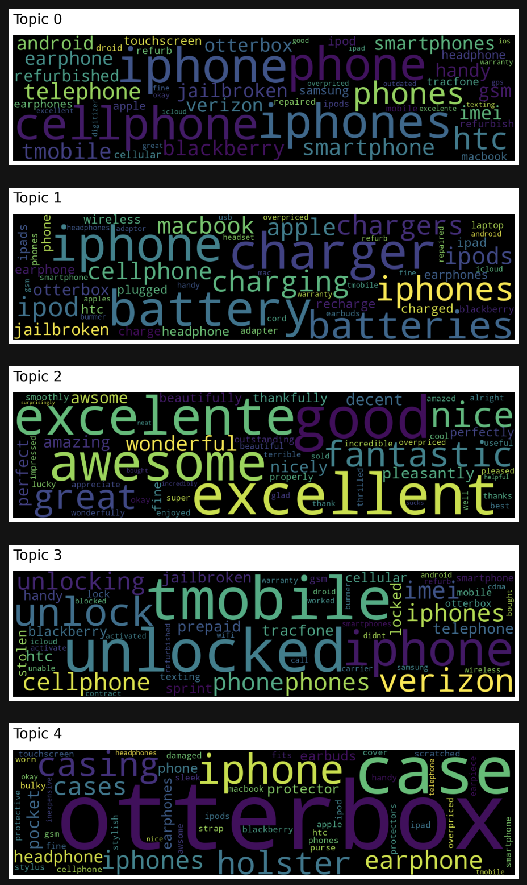
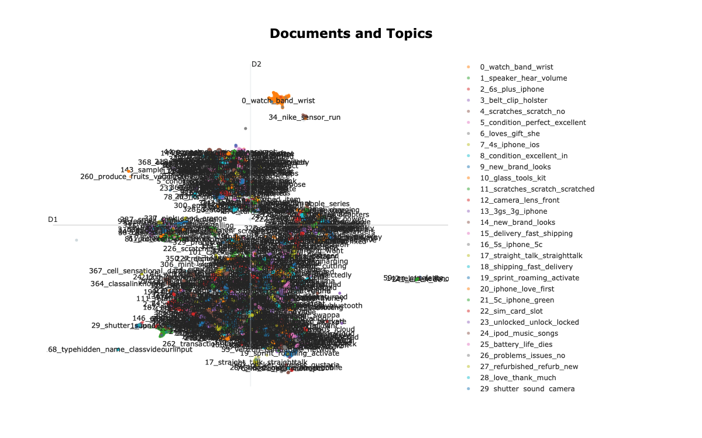
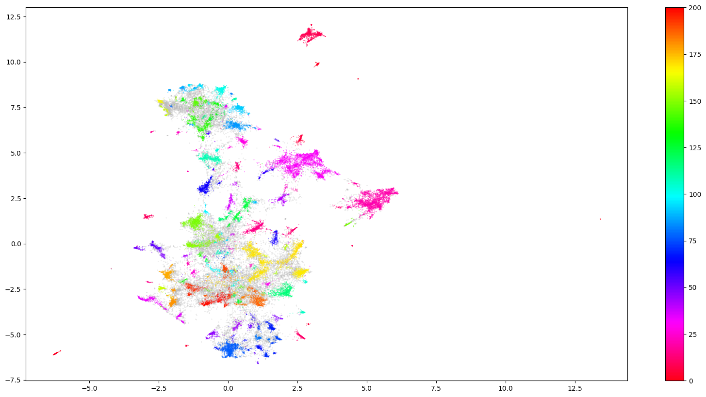

# Review Topic Modeling

Unsupervised **topic modeling of ~82,000 Amazon reviews of Apple products**, comparing two modern embedding-based approaches — **Top2Vec** and **BERTopic** — to discover what customers actually talk about, without any predefined categories.

Developed as the final project for the *Natural Language Processing* course at Copenhagen Business School (CBS).

## Goal

Given a large, noisy corpus of product reviews, can we automatically surface coherent, interpretable themes (battery life, carrier unlocking, cases & accessories, sentiment, …) using sentence embeddings + clustering instead of classic bag-of-words LDA?

## Data

- **`apple.csv`** — ~82k raw Amazon reviews of Apple-branded products (standard Amazon Review Data fields: `reviewText`, `summary`, `overall`, `asin`, …).
- **`apple_preprocessed.csv`** — the cleaned corpus produced by `00_Preprocessing.ipynb`.

Preprocessing (`00_Preprocessing.ipynb`): merge each review's `summary` + `reviewText` into a single `corpus` field, drop missing/empty entries, strip placeholder "Four Stars"-style summaries, remove non-English and very short (<5 word) reviews (`langdetect`), and clean whitespace.

## Methods

| Notebook | Approach | Pipeline |
|---|---|---|
| `01_Top2Vec.ipynb` | **Top2Vec** | Universal Sentence Encoder (multilingual) embeddings → UMAP → HDBSCAN; topic vectors as cluster centroids, top words by cosine similarity. |
| `02_BERTopic_library.ipynb` | **BERTopic (library)** | `all-MiniLM-L6-v2` embeddings → UMAP → HDBSCAN → `BERTopic` (c-TF-IDF topic words), reduced to 20 topics. |
| `03_BERTopic_from_scratch.ipynb` | **BERTopic, reimplemented manually** | `all-MiniLM-L12-v2` → UMAP → HDBSCAN → hand-written **class-based c-TF-IDF** for topic words → iterative topic merging by cosine similarity. Demonstrates the mechanics behind the library. |

## Results

The discovered topics are clean and intuitive. A few highlights:

### Top2Vec topic word clouds
Word size reflects each word's cosine similarity to the topic vector. The leading topics map neatly to real themes — handsets, charging & batteries, positive sentiment, carrier unlocking, and cases/accessories.



### BERTopic — Intertopic Distance Map *(interactive)*
Each bubble is a topic, **sized by how many reviews it contains** and positioned by topic similarity (UMAP over the topic embeddings; inspired by LDAvis). In the notebook this is a live Plotly chart — hover a bubble for its top words and use the slider to isolate topics.


### BERTopic — Documents & Topics *(interactive)*
Every point is a single review, placed by its embedding and colored by assigned topic, with clusters annotated by auto-generated labels (e.g. `0_watch_band_wrist`, `22_sim_card_slot`, `25_battery_life_dies`). In the notebook you can hover any point to read the underlying review and zoom into dense regions.



### From-scratch BERTopic — document clusters
Review embeddings reduced to 2-D with UMAP and clustered with HDBSCAN in the manual implementation. Colored points are clustered reviews (one color per topic); gray points are HDBSCAN outliers.



> The interactive charts (distance map, documents) are static snapshots here — open `02_BERTopic_library.ipynb` to explore the live Plotly versions.

## Repository structure

```
.
├── 00_Preprocessing.ipynb           # Clean raw reviews → apple_preprocessed.csv
├── 01_Top2Vec.ipynb                 # Approach 1: Top2Vec
├── 02_BERTopic_library.ipynb        # Approach 2a: BERTopic via the library
├── 03_BERTopic_from_scratch.ipynb   # Approach 2b: BERTopic reimplemented by hand
├── apple.csv                        # Raw Amazon reviews (Apple products)
├── apple_preprocessed.csv           # Cleaned corpus
├── docs/                            # Figures used in this README
└── experiments/                     # Earlier iterations / scratch notebooks
```

## Running

The notebooks were developed in Google Colab. To run locally:

```bash
python3 -m venv .venv && source .venv/bin/activate
pip install -r requirements.txt
jupyter lab
```

Run `00_Preprocessing.ipynb` first to generate `apple_preprocessed.csv`, then any of the modeling notebooks. Embedding the full corpus benefits from a GPU.

## Acknowledgements

Built on [Top2Vec](https://github.com/ddangelov/Top2Vec) and [BERTopic](https://github.com/MaartenGr/BERTopic). Review data is a subset of the publicly available Amazon product review data filtered to Apple products.
